**Q08 разбор задач t16-17**

_список справочника с отбором без групп_

<details>
<summary>code</summary>

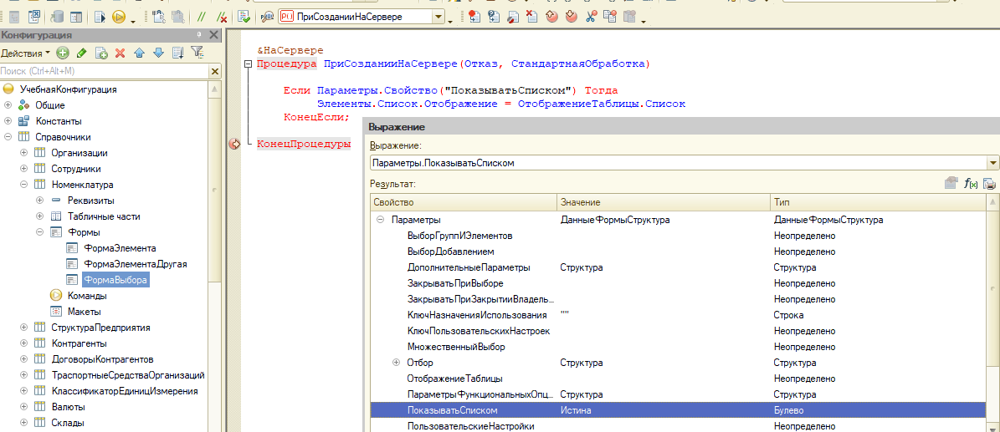

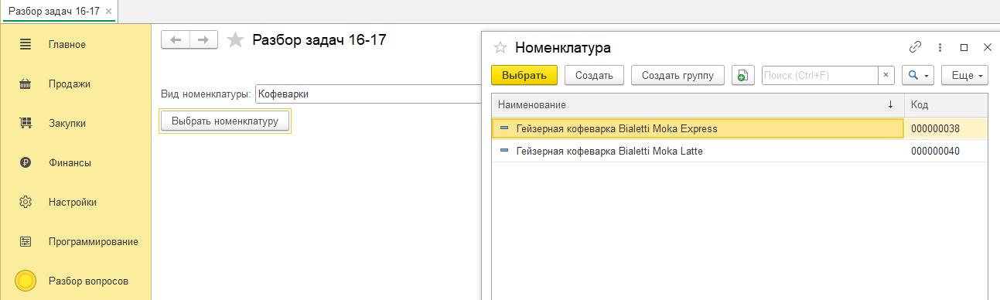

```js
//создали обработку с выбором по номерклатуре
//открываем форму выбора, расширяем параметры формы пользовательским параметром("ПоказатьСписком")
&НаКлиенте
Процедура ВыбратьНоменклатуру(Команда)

	СтруктураОтбор =  Новый Структура("ВидНоменклатуры",ВидНоменклатуры );

	ПараметрыФормы = Новый Структура;
	ПараметрыФормы.Вставить("Отбор", СтруктураОтбор);
	ПараметрыФормы.Вставить("ПоказыватьСписком",Истина);

	ОткрытьФорму("Справочник.Номенклатура.ФормаВыбора", ПараметрыФормы);

КонецПроцедуры

//создаем новую форму выбора справочника с нюансами отображения(списком без групп(папок))
&НаСервере
Процедура ПриСозданииНаСервере(Отказ, СтандартнаяОбработка)

	Если Параметры.Свойство("ПоказыватьСписком") Тогда
		 Элементы.Список.Отображение = ОтображениеТаблицы.Список
	КонецЕсли;

КонецПроцедуры

```

</details>

---

_работа с текстом(получение, отображение)_

<details>
<summary>code</summary>

```js
  &НаКлиенте
  Процедура ПоказатьТекст(Команда)

  Текст = Новый ТекстовыйДокумент;
  ПоказатьТекстНаСервере(Текст);
  Текст.Показать("Данные файла");

	//Текст.Запись("С\temp\текст.txt");

  КонецПроцедуры

  &НаСервереБезКонтекста
  Процедура ПоказатьТекстНаСервере(Текст)

  Выборка = Справочники.Номенклатура.Выбрать();
  Пока Выборка.Следующий()  Цикл

  	ТекСтрока = Выборка.Наименование + ";" + Выборка.Артикул + ";" + Выборка.Код + ";";
  	Текст.ДобавитьСтроку(ТекСтрока);

  КонецЦикла;

  КонецПроцедуры

```

</details>

---

_проверка на пустоту динамического списка_

<details>
<summary>code</summary>

---

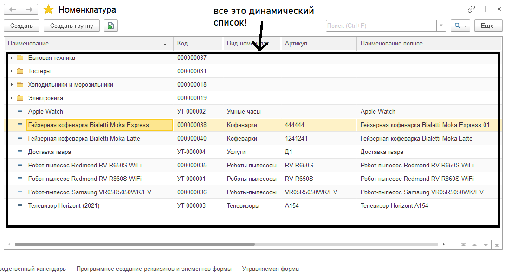
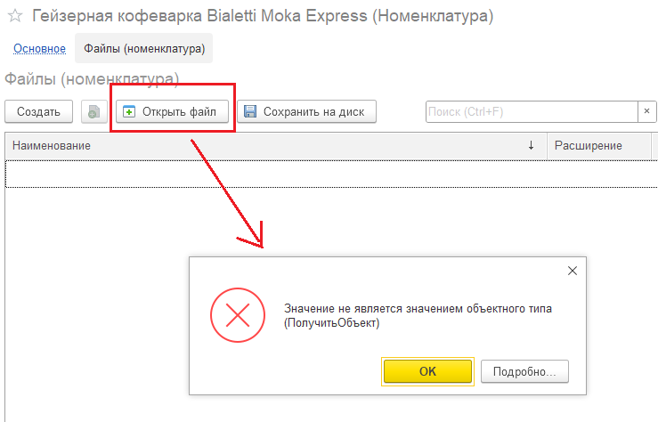

1. Переходим в конфигуратор по ошибке → Ставим точку останова → Перезапускаем
2. Shift + F9 → смотрим, что за фу. → Выясняем откуда вызвана фу. → Отладчик → Стек вызовов(Ctrl + Alt + C - позволяет понять как попали в точку из каких процедур, функций)
   // и так в цикле возвращаемся к началу выполняя шаги 1 и 2.
   // если вызов один, значит это не результат вызова процедур или функций, а самой системы, тогда Ctrl + F → смотрим откуда текущая функция вызывается:

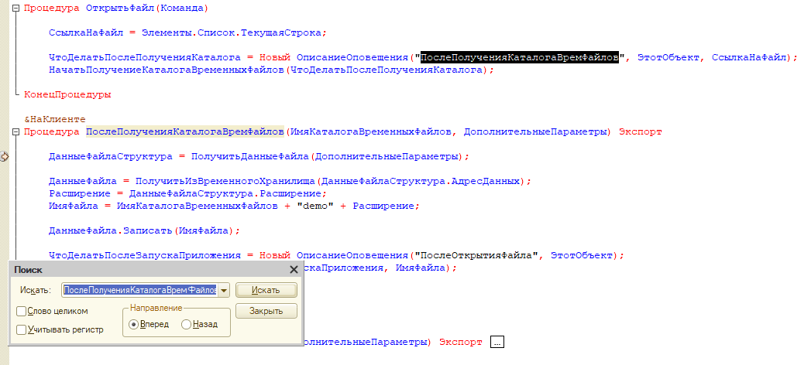

3. поднимаемся выше, видим, откуда появилось неопределено, делаем выводы...

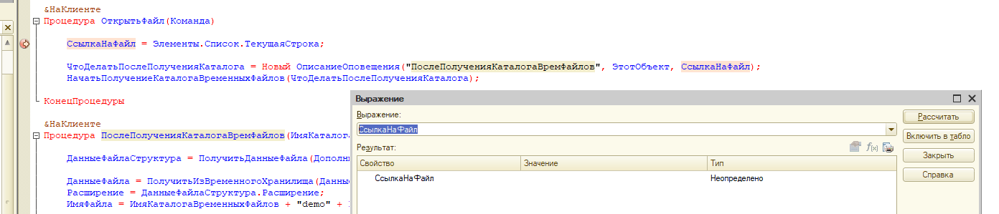

// текущая строка пустая, сл-но нужна проверка на пустону, чтобы не допускать ошибки.

```js
// ПРОВЕРКА
Если СсылкаНаФайл = Неопределено Тогда
  Возврат
КонецЕсли;
```

<!-- Alt + Shift + F - выравнивание кода в конфигураторе -->

</details>

---

_открыть форму текущего элемента_

<details>
<summary>code</summary>

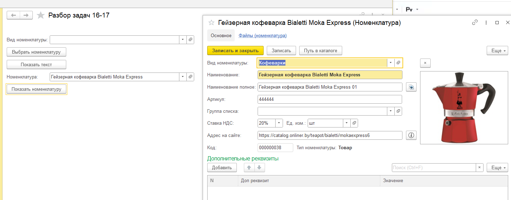

```js
&НаКлиенте
процедура ОткрытьФормуТекущегоЭлементаСтроки(Команда)
//Содержание→Интерфейс→Форма клиентского приложения→Расширение объектов→Параметры формы→Ключ()
 ПараментыФормы = Новый Структура("Ключ",Номенклатура);
 ОткрытьФорму("Справочник.Номенклатура.Форма", ПараметрыФормы);

```

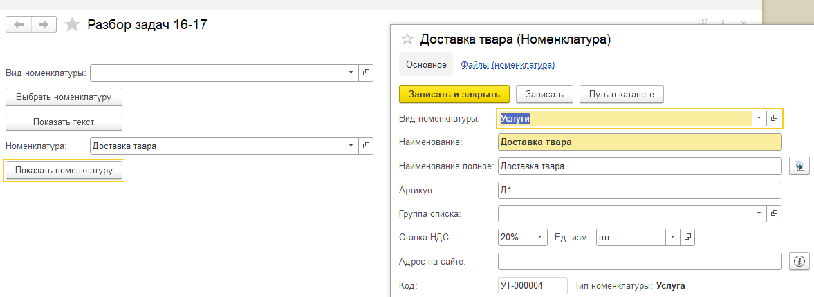

</details>

---

_добавить редактирование формы на кленте_

<details>
<summary>code</summary>

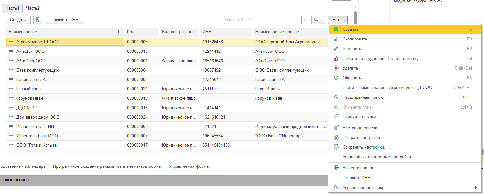
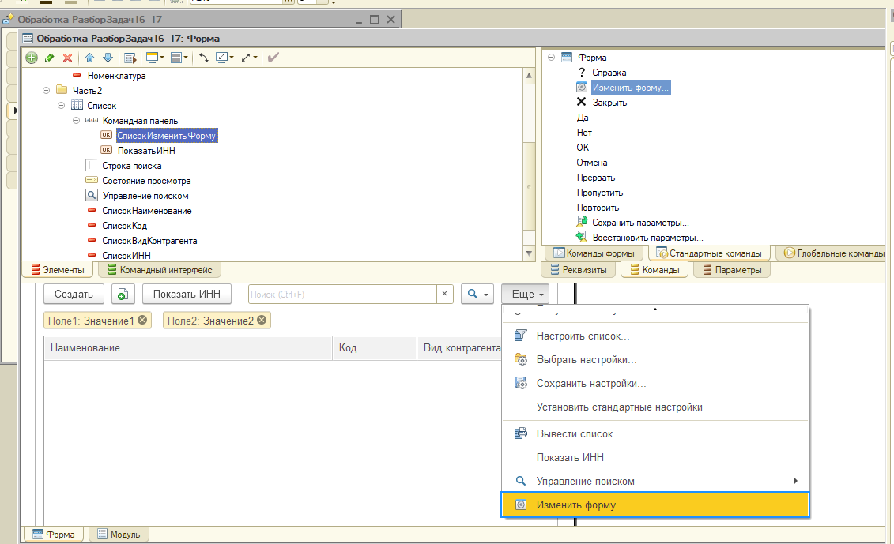
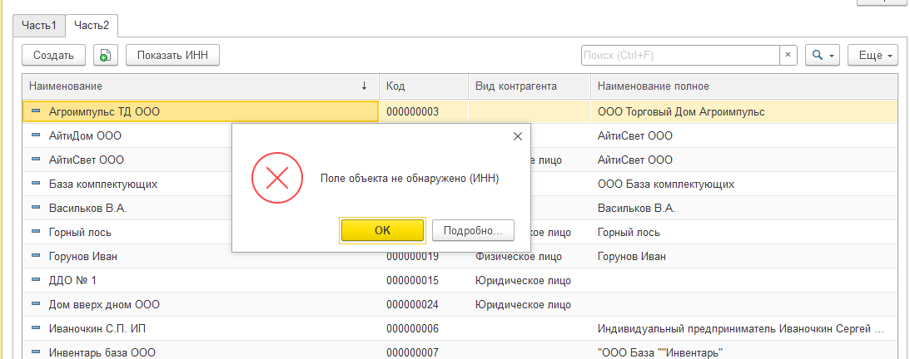

---

## // полученеие данных для динамического списка без ограничения пользовательского интерфейса

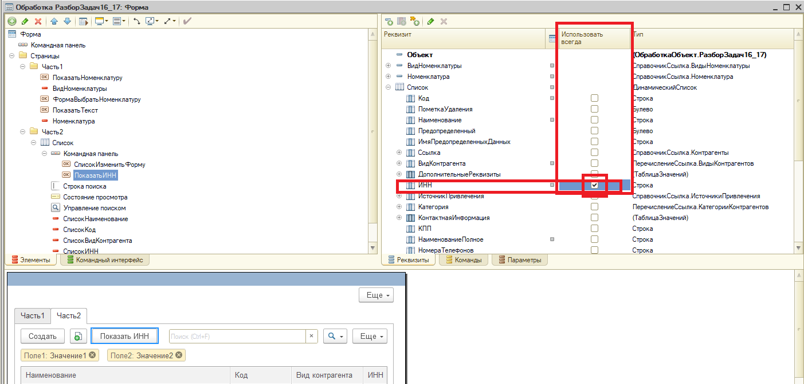

</details>

---

_условное оформление формы_

<details>
<summary>code</summary>
// выделим заказы сумма которых больше 200тр.

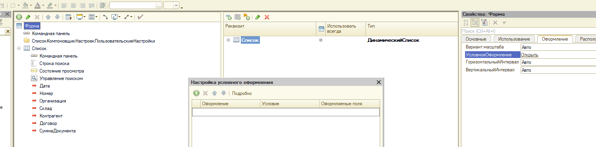
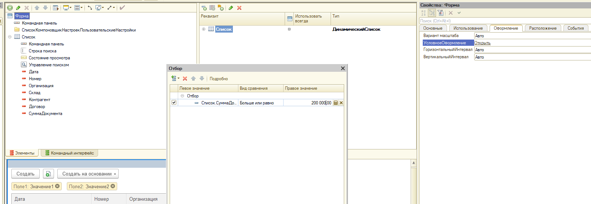
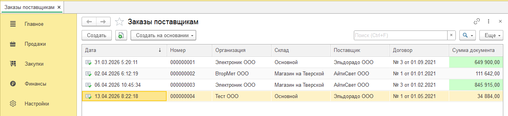

**используя условное оформление можно изменить доступность определенных колонок в таблице в зависимости от определенных условий**

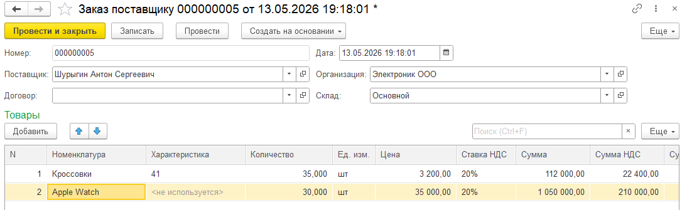

```js

&НаКлиенте
Процедура ТоварыНоменклатураПриИзменении(Элемент)

  // изменение номенклатуры код

	ТоварнаяПозиция.ИспользоватьХарактеристики = ПолучитьПризнакиИспоьзованияХарактеристики(ТоварнаяПозиция.Номенклатура);

КонецПроцедуры

&НаСервереБезКонтекста
Функция ПолучитьПризнакиИспоьзованияХарактеристики(Номенклатура)

	Возврат Номенклатура.ИспользоватьХарактеристики;

КонецФункции // ПолучитьПризнакиИспользования()


```

</details>

---

_быстрый поиск формы_

<details>
<summary>code</summary>

**информация для технического специалиста на троеточии**
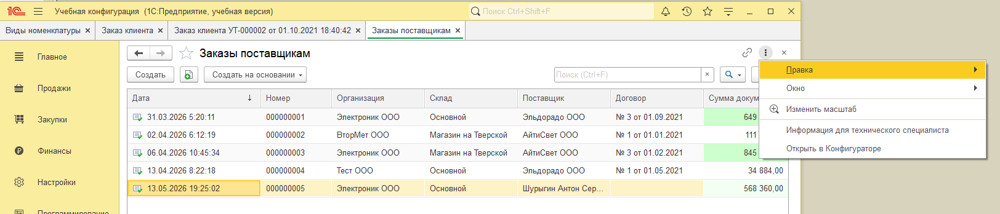
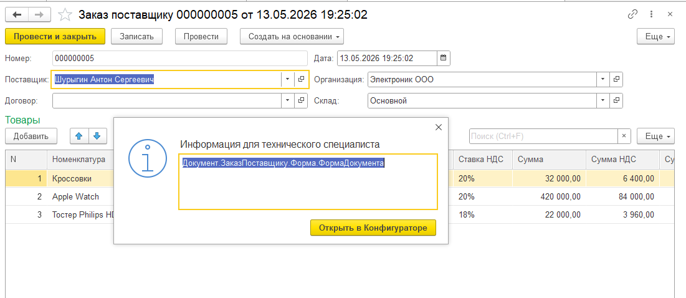

</details>

---

_доп. реквизиты отдельными полями на форме_

<details>
<summary>code</summary>

**фильтр по перечню доп. реквизитов для справочника номенклатуры товаров**

1. Параметры Выбора → Отбор.Родитель(Справочник_Номенклатура)
   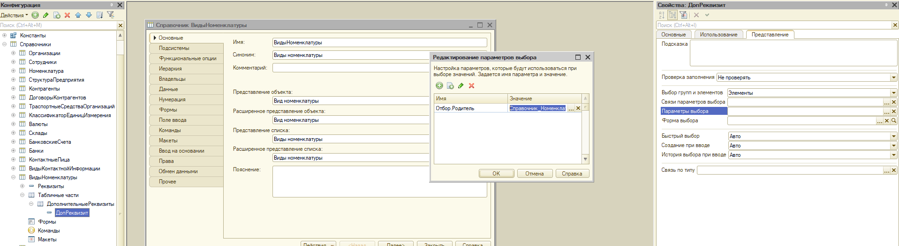
   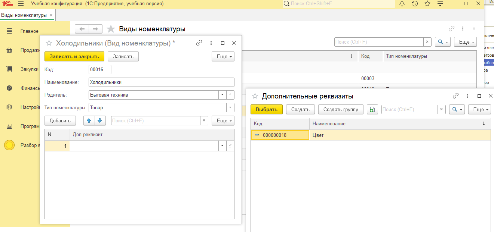

```js

&НаКлиенте
Процедура ВидНоменклатурыПриИзменении(Элемент)
	Объект.ТипНоменклатуры = ПолучитьТипНоменклатуры(Объект.ВидНоменклатуры);

	ОбновитьСвойстваВидовНоменклатуры();

КонецПроцедуры

---
&НаСервере
Процедура ОбновитьСвойстваВидовНоменклатуры()

	//-1. получаем список доп. реквизитов
	Если Объект.ВидНоменклатуры.Пустая() Тогда
		Возврат
	КонецЕсли;

	УдаляемыеРеквизиты = Новый Массив;
	//0.удаление ранее созданных реквизитов  и элементов
	Для каждого СтрокаОписания Из ОписаниеДополнительныхРеквизитов Цикл
		УдаляемыеРеквизиты.Добавить(СтрокаОписания.ИмяРеквизита);
		Элементы.Удалить(Элементы[СтрокаОписания.ИмяРеквизита]);
	КонецЦикла;

	ОписаниеДополнительныхРеквизитов.Очистить();

	//1.создание реквизита формы: 1 свойство - 1 реквизит
	ДобавляемыеРеквизиты = Новый Массив;

	ВидОбъект = Объект.ВидНоменклатуры.ПолучитьОбъект();
	Для каждого СтрокаРеквизита Из ВидОбъект.ДополнительныеРеквизиты Цикл
		//создаем уникальное имя реквизита
		Идентификатор = Новый УникальныйИдентификатор;
		ИмяРеквизита = "Реквизит_" + СтрЗаменить(Идентификатор,"-","");   //PHOTOS1
		//создаем новый реквизит
		ТипРеквизита = СтрокаРеквизита.ДопРеквизит.ТипЗначения;
		ЗаголовокРеквижита = СтрокаРеквизита.ДопРеквизит.Наименование;
		НовыйРеквизит = Новый РеквизитФормы(ИмяРеквизита,ТипРеквизита,,ЗаголовокРеквижита);

		ДобавляемыеРеквизиты.Добавить(НовыйРеквизит);  //PHOTOS2

		//добавление инф. о доп. реквизите в реквизите-таблице на форме - ОписаниеДополнительныхРеквитов
		//с тем, чтобы не дублировать уже существующие свойства реквизитов...
		СтрокаОписания = ОписаниеДополнительныхРеквизитов.Добавить();
		СтрокаОписания.ИмяРеквизита = ИмяРеквизита;
		СтрокаОписания.ДопРеквизит = СтрокаРеквизита.ДопРеквизит;   //PHOTOS4

	КонецЦикла;

    ИзменитьРеквизиты(ДобавляемыеРеквизиты);

	//2.для каждого реквизита создадим элемент формы
	Для каждого Реквизит Из ДобавляемыеРеквизиты Цикл

		НовыйЭлемент = Элементы.Добавить(Реквизит.Имя, Тип("ПолеФормы"),Элементы.ГруппаДополнительныеРеквизиты);
		НовыйЭлемент.ПутьКДанным = Реквизит.Имя;
		НовыйЭлемент.Вид         = ВидПоляФормы.ПолеВвода;
		НовыйЭлемент.Заголовок   = Реквизит.Заголовок;        //PHOTOS5

		НовыйЭлемент.УстановитьДействие("ПриИзменении","ПриИзмененииДопРеквизита");

		Элементы.Переместить(НовыйЭлемент,Элементы.ГруппаДополнительныеРеквизиты,Элементы.ДополнительныеРеквизиты);

	КонецЦикла;

	//3.заполнение реквизитов формы значениями из таблицы

	Для каждого СтрокаОписания Из ОписаниеДополнительныхРеквизитов Цикл

		ДопРеквизит = СтрокаОписания.ДопРеквизит;
		СтруктураПоиска = Новый Структура("ДопРеквизит",ДопРеквизит);
		НайденныеСтроки = Объект.ДополнительныеРеквизиты.НайтиСтроки(СтруктураПоиска);

		Если НайденныеСтроки.Количество() > 0 Тогда
			СтрокаЗначения = НайденныеСтроки[0];
			ЭтотОбъект[СтрокаОписания.ИмяРеквизита] = СтрокаЗначения.Значение;
		КонецЕсли;

	КонецЦикла;

КонецПроцедуры // ОбновитьСвойстваВидовНоменклатуры()

```

---

**PHOTOS1**

в идентификаторе не должно быть дефисов→убираем(СтрЗаменить)

![alt text][PHOTOS1]
![alt text][PHOTOS2]
![alt text][PHOTOS3]
**доп.реквизиты сохраненные на уровне формы**
![alt text][PHOTOS4]
![alt text][PHOTOS5]

---

[PHOTOS1]: ../img/q08/rekvizit.png
[PHOTOS2]: ../img/q08/rekvizit2.png
[PHOTOS3]: ../img/q08/rekvizit3.png
[PHOTOS4]: ../img/q08/rekvizit4.png
[PHOTOS5]: ../img/q08/rekvizit5.png

---

1. отображаем реквизиты в выбранном месте:

   ```js
   Элементы.Переместить(
     НовыйЭлемент,
     Элементы.ГруппаДополнительныеРеквизиты,
     Элементы.ДополнительныеРеквизиты,
   );
   ```

   ***

   ![alt text][PHOTOS6]

2. переносим данные из реквизитов формы(не заносящихся в базу при записи) в реквизиты объекта формы - записывающиеся в базу

   ```js

   &НаСервере
   Процедура ПередЗаписьюНаСервере(Отказ, ТекущийОбъект, ПараметрыЗаписи)

   // код
   	ТекущийОбъект.ДополнительныеРеквизиты.Очистить();

   	Для каждого СтрокаОписания Из ОписаниеДополнительныхРеквизитов Цикл
   		СтрокаТЧ = ТекущийОбъект.ДополнительныеРеквизиты.Добавить();
   		СтрокаТЧ.ДопРеквизит = СтрокаОписания.ДопРеквизит;
   		СтрокаТЧ.Значение = ЭтотОбъект[СтрокаОписания.ИмяРеквизита];
   	КонецЦикла;

   КонецПроцедуры
   ```

[PHOTOS6]: ../img/q08/rekvizit6.png

3. перенос данных из таблицы в реквизиты формы при открытии формы

   ```js
   	//3.заполнение реквизитов формы значениями из таблицы

   Для каждого СтрокаОписания Из ОписаниеДополнительныхРеквизитов Цикл

   	ДопРеквизит = СтрокаОписания.ДопРеквизит;
   	СтруктураПоиска = Новый Структура("ДопРеквизит",ДопРеквизит);
   	НайденныеСтроки = Объект.ДополнительныеРеквизиты.НайтиСтроки(СтруктураПоиска);

   	Если НайденныеСтроки.Количество() > 0 Тогда
   		СтрокаЗначения = НайденныеСтроки[0];
   		ЭтотОбъект[СтрокаОписания.ИмяРеквизита] = СтрокаЗначения.Значение;
   	КонецЕсли;

   ```

   **отключаем пользовательскую видимость дополнительных реквизитов**

   ![alt text][PHOTOS7]

[PHOTOS7]: ../img/q08/rekvizit7.png

---

4. добавить признак модифицированности

   ```js
   //Процедура ОбновитьСвойстваВидовНоменклатуры()
   НовыйЭлемент.УстановитьДействие("ПриИзменении","ПриИзмененииДопРеквизита");

   &НаКлиенте
   Процедура ПриИзмененииДопРеквизита(Элемент)
   	Модифицированность = Истина;
   КонецПроцедуры // ()
   ```

</details>
