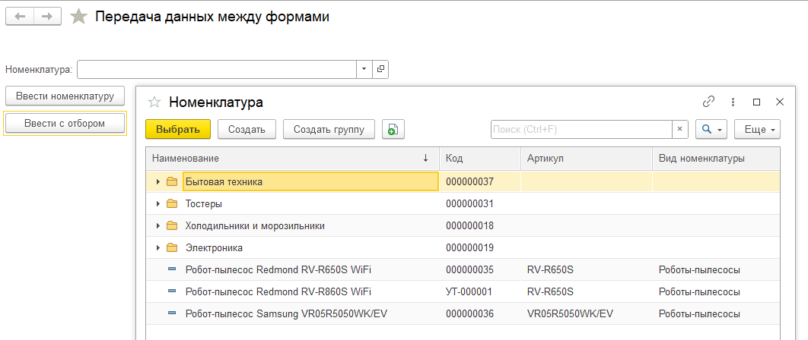
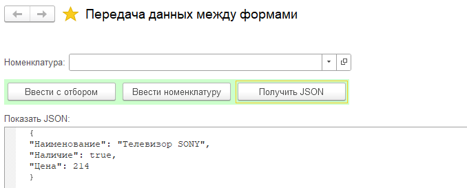

**Q10: разбор задач t14-t15**

---

_1. Передача днных между формами_

<details>
<summary>пример</summary>


```js


&НаКлиенте
Процедура ВвестиНоменклатуру(Команда)

	ЧтоДелатьПосле = Новый ОписаниеОповещения("ПослеОткрытияНоменклатуры",ЭтотОбъект);

	ОткрытьФорму("Справочник.Номенклатура.Форма.ФормаВыбораУпрощенная",,,,,,ЧтоДелатьПосле);
КонецПроцедуры

&НаКлиенте
Процедура ПослеОткрытияНоменклатуры(Результат, ДополнительныеПараметры) Экспорт

	Если Результат = Неопределено Тогда
		Возврат;
	КонецЕсли;

	Номенклатура = Результат;

КонецПроцедуры // ПослеОткрытияНоменклатуры()

```

</details>

---

_2. Передача днных между формами с отбором _

<details>

<summary>пример</summary>

    Поиск→Интерфейс(управляемый)→Расширение динамического списка→Параметры формы→Отбор



```js

&НаКлиенте
Процедура ПослеОткрытияНоменклатуры(Результат, ДополнительныеПараметры) Экспорт

	Если Результат = Неопределено Тогда
		Возврат;
	КонецЕсли;

	Номенклатура = Результат;

КонецПроцедуры // ПослеОткрытияНоменклатуры()


&НаСервереБезКонтекста
Функция  ВвестиСОтборомНаСервере()

	ВидыНоменклатурыСсылка = Справочники.ВидыНоменклатуры.НайтиПоНаименованию("Роботы-пылесосы");
	Возврат ВидыНоменклатурыСсылка;

КонецФункции

&НаКлиенте
Процедура ВвестиСОтбором(Команда)

	ЧтоДелатьПосле = Новый ОписаниеОповещения("ПослеОткрытияНоменклатуры",ЭтотОбъект);

	ВидыНоменклатурыСсылка = ВвестиСОтборомНаСервере();

	ПараметрыОтбора = Новый Структура("ВидНоменклатуры",ВидыНоменклатурыСсылка );

	ПараметрыФормы = Новый Структура;
	ПараметрыФормы.Вставить("ЗакрыватьПриВыборе", Ложь);
	ПараметрыФормы.Вставить("Отбор",ПараметрыОтбора);

	ОткрытьФорму("Справочник.Номенклатура.Форма.ФормаВыбораУпрощенная",ПараметрыФормы,,,,,ЧтоДелатьПосле);

КонецПроцедуры

```

</details>

---

_3. Преобразуем структуру в JSON _

<details>

<summary>пример</summary>



```js

&НаКлиенте
Процедура ПреобразоватьСтруктуруВJSON(Команда)
	ИсходнаяСтруктура = Новый Структура;
	ИсходнаяСтруктура.Вставить("Наименование","Телевизор SONY");
	ИсходнаяСтруктура.Вставить("Наличие", Истина);
	ИсходнаяСтруктура.Вставить("Цена", 214);

	ЗапишемВJSON = Новый ЗаписьJSON();
	ЗапишемВJSON.УстановитьСтроку();

	ЗаписатьJSON(ЗапишемВJSON, ИсходнаяСтруктура);

	ПоказатьJSON = 	ЗапишемВJSON.Закрыть();

КонецПроцедуры
```

</details>
