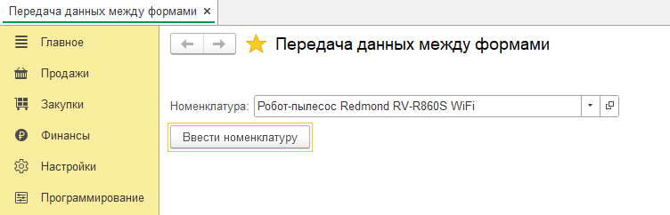

**Q10: разбор задач t14-t15**

---

_1. Передача днных между формами_

<details>
<summary>пример</summary>



```js


&НаКлиенте
Процедура ВвестиНоменклатуру(Команда)

	ЧтоДелатьПосле = Новый ОписаниеОповещения("ПослеОткрытияНоменклатуры",ЭтотОбъект);

	ОткрытьФорму("Справочник.Номенклатура.Форма.ФормаВыбораУпрощенная",,,,,,ЧтоДелатьПосле);
КонецПроцедуры

&НаКлиенте
Процедура ПослеОткрытияНоменклатуры(Результат, ДополнительныеПараметры) Экспорт

	Если Результат = Неопределено Тогда
		Возврат;
	КонецЕсли;

	Номенклатура = Результат;

КонецПроцедуры // ПослеОткрытияНоменклатуры()

```

</details>
