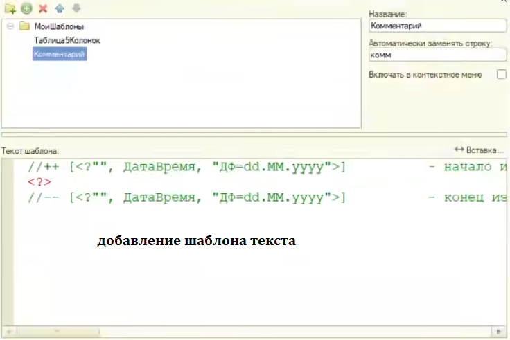
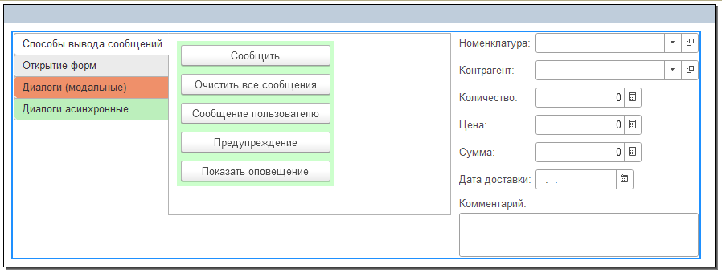
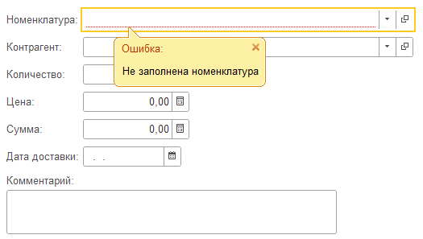
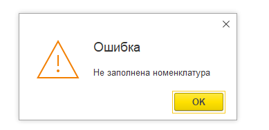
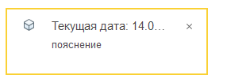
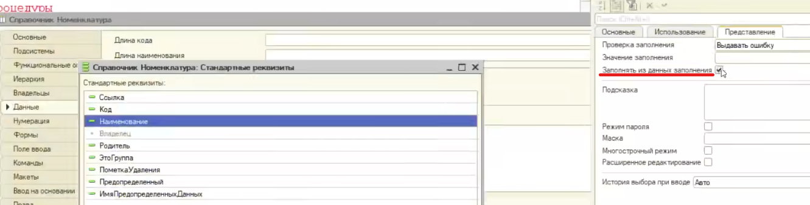
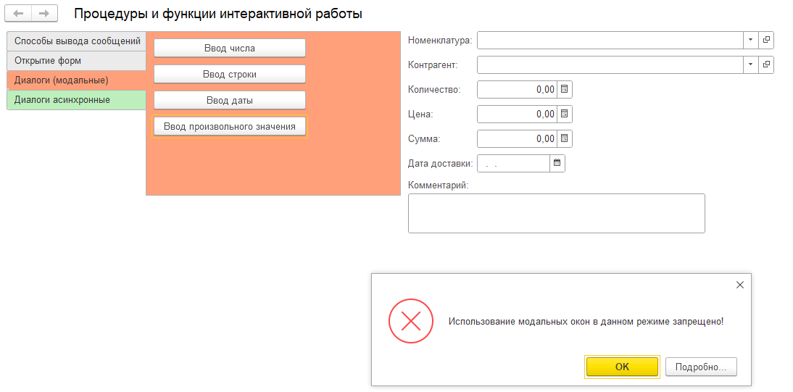

**Т15: Проц. и функ интерактивн. работы, модальн.ок, асинк.методы**

---

_1. Шаблоны текста_

    Ctrl + Shift + T, Ctrl + Space

<details>
<summary>пример</summary>

[сервис для 1с спецов, шаблоны и пр. → fastcode.im](https://fastcode.im/)

например: Преобразовать таблицу значений в массив

```js
мсДанных = Новый Массив;

Для Каждого СтрокаТЗ Из тзДанных Цикл

    стСтрокаТаблицы = Новый Структура;

    Для Каждого ИмяКолонки Из тзДанных.Колонки Цикл

        стСтрокаТаблицы.Вставить(ИмяКолонки.Имя, СтрокаТЗ[ИмяКолонки.Имя]);

    КонецЦикла;

    мсДанных.Добавить(стСтрокаТаблицы);

КонецЦикла;

```

---



</details>

---

_2. Сообщения пользователю_

    (Ctrl + Shift +F1)
    поиск→глоб.конт→проц.фун.интр.работы→ОчиститьСообщения()

<details>
<summary>пример</summary>

    - сообщить (УСТАРЕВШИЙ!)/очистить



_сообщить/очистить все сообщения_

```js
&НаКлиенте
Процедура МетодСообщить(Команда)

Сообщить("Текущая дата: " + ТекущаяДата());

КонецПроцедуры

&НаКлиенте
Процедура ОчиститьВсеСообщения(Команда)

ОчиститьСообщения();

КонецПроцедуры


```

_сообщение пользователю_

    Поиск→СообщениеПользователю



```js

&НаКлиенте
Процедура ОбъектСообщениеПользователю(Команда)

	//Сообщение = Новый СообщениеПользователю;
	//Сообщение.Текст = "Текущая дата: " + ТекущаяДата();
	//Сообщение.Сообщить();

	Сообщение = Новый СообщениеПользователю;
	Сообщение.Текст = "Не заполнена номенклатура";
	Сообщение.Поле = "Реквизит_Номенклатура";
	Сообщение.Сообщить();


КонецПроцедуры
```

_показать оповещение_ (только на клиенте!)

    Поиск→ПоказатьОповещениеПользователю




```js

// (!)при включенной модальности
&НаКлиенте
Процедура МетодПредупреждение(Команда)

	Предупреждение("Не заполнена номенклатура",5,"Ошибка");
	Сообщить("Выведено предупреждение");

КонецПроцедуры

&НаКлиенте
Процедура МетодПоказатьОповещение(Команда)

	ПоказатьОповещениеПользователя("Текущая дата: " + ТекущаяДата(),, "пояснение", БиблиотекаКартинок.ВнешнийИсточникДанныхКуб);

КонецПроцедуры

```

</details>

---

_3. Открытие форм_

    (Ctrl + Shift +F1)
    поиск→глоб.конт→проц.фун.интр.работы→ОткрытьФорму()
    Расширение формы клиентского приложения для справочника/документа.../пр.
    содержание→интерфейс→форма клиентского приложения→расширение объектов→параметры формы→Ключ()

<details>

<summary>пример</summary>

```js
&НаКлиенте
Процедура ОткрытьФормуСпискаНоменклатуры(Команда)

	ОткрытьФорму("Справочник.Номенклатура.ФормаСписка");

КонецПроцедуры

&НаКлиенте
Процедура ОткрытьФормуНовойНоменклатуры(Команда)

	ОткрытьФорму("Справочник.Номенклатура.ФормаОбъекта");

	//ОткрытьФорму("Справочник.Номенклатура.Форма.ФормаЭлементаДругая");

КонецПроцедуры

&НаКлиенте
Процедура ОткрытьФормуНоменклатуры(Команда)

	СтруктураПараметры = Новый Структура("Ключ", Реквизит_Номенклатура);
	ОткрытьФорму("Справочник.Номенклатура.ФормаОбъекта", СтруктураПараметры);

КонецПроцедуры

```

---

Заполнять из данных заполнения(!)


```js

&НаКлиенте
Процедура ОткрытьФормуСПередачейЗначенийЗаполнения(Команда)

	ЗначенияЗаполнения = Новый Структура;
    // Работает только если флажек "заполнять из данных заполнения активирован"
	ЗначенияЗаполнения.Вставить("Наименование", "Новый товар");

	СтруктураПараметры = Новый Структура("ЗначенияЗаполнения", ЗначенияЗаполнения);
	ОткрытьФорму("Справочник.Номенклатура.ФормаОбъекта", СтруктураПараметры);

КонецПроцедуры

```

---

открыть форму списка с отбором, варианты блокировки интерфейса

    Поиск→Содержание→Интерфейс→ФКП→Расширение динамического списка→Параметры формы→Отбор()

```js

&НаКлиенте
Процедура ОткрытьФормуСпискаСОтбором(Команда)

	//формирование структуры отбора (Ключ - имя реквизита, Значение - знаение отбора)
	СтруктураОтбора = Новый Структура("ВидКонтрагента", ПредопределенноеЗначение("Перечисление.ВидыКонтрагентов.ФизическоеЛицо"));

	//формирование структуры параметров формы (Ключ - имя параметра, Значение - значечние параметра)
	СтруктураПараметров = Новый Структура("Отбор", СтруктураОтбора);

	//открытие формы с передачей параметров
    //варианты блокировки формы/интерфейса
	ОткрытьФорму("Справочник.Контрагенты.ФормаСписка", СтруктураПараметров,ЭтотОбъект,,,,,РежимОткрытияОкнаФормы.БлокироватьОкноВладельца);

КонецПроцедуры


```

</details>

---

_4. Запрос данных у пользователя(диалоги модальные)УСТАРЕВШЕЕ-vs-ASYNC_

    Поиск→Глобальный контекст→ФдВДВД(функц.для.выз.диал.ввода.данных)→Ввести/число/дату/строку/значение

<details>

<summary>пример</summary>



```js
&НаКлиенте
Процедура ВводЧисла(Команда)

	ВведенноеЧисло = 0;
	Результат = ВвестиЧисло(ВведенноеЧисло, "Введите количество товара");
	Если Результат = Истина Тогда
		Количество = ВведенноеЧисло;
		Сообщение = Новый СообщениеПользователю;
		Сообщение.Текст = "Вы ввели число " + ВведенноеЧисло;
		Сообщение.Сообщить();
	КонецЕсли;

КонецПроцедуры

&НаКлиенте
Процедура ВводСтроки(Команда)

	ВведеннаяСтрока = "";
	Результат = ВвестиСтроку(ВведеннаяСтрока, "Введите комментарий");
	Если Результат = Истина Тогда
		Комментарий = ВведеннаяСтрока;
		Сообщение = Новый СообщениеПользователю;
		Сообщение.Текст = "Вы ввели число " + ВведеннаяСтрока;
		Сообщение.Сообщить();
	КонецЕсли;

КонецПроцедуры

&НаКлиенте
Процедура ВводДаты(Команда)

	ВведеннаяДата = '00010101';
	Результат = ВвестиДату(ВведеннаяДата, "Выберите дату доставки", ЧастиДаты.Дата);
	Если Результат = Истина Тогда
		ДатаДоставки = ВведеннаяДата;
		Сообщение = Новый СообщениеПользователю;
		Сообщение.Текст = "Вы ввели дату: " + ВведеннаяДата;
		Сообщение.Сообщить();
	КонецЕсли;

КонецПроцедуры

&НаКлиенте
Процедура ВводПроизвольногоЗначения(Команда)

	ВведнныйКонтрагент = Неопределено;
	Результат = ВвестиЗначение(ВведнныйКонтрагент, "Введите контрагента", Тип("СправочникСсылка.Контрагенты"));
	Если Результат = Истина Тогда
		Контрагент = ВведнныйКонтрагент;
		Сообщение = Новый СообщениеПользователю;
		Сообщение.Текст = "Вы выбрали контрагента: " + ВведнныйКонтрагент;
		Сообщение.Сообщить();
	КонецЕсли;

КонецПроцедуры

```

</details>

---

_5. ASYNC(число,строка,дата,значение)_

    Поиск→Глобальный контекст→ФдВДВД(функ.для.вызова.диалога.ввода.данных)→ВвестиДатуАсинх/Строку/Число/Значения

> Асинх.методы → Выполняемые процедуры - ЭКСПОРТНЫЕ!

<details>

<summary>пример</summary>

```js
&НаКлиенте
Процедура ВводЧислаАсинхронно(Команда)

	ВведенноеЧисло = 0;
	ЧтоДелатьПослеВводаЧисла = Новый ОписаниеОповещения("ПослеВводаЧисла", ЭтотОбъект);

	ПоказатьВводЧисла(ЧтоДелатьПослеВводаЧисла, ВведенноеЧисло, "Введите количество товара");

	Сообщить("код выполняется дальше");

КонецПроцедуры

&НаКлиенте
Процедура ПослеВводаЧисла(Число, ДополнительныеПараметры) Экспорт

	Если Число = Неопределено Тогда
		Возврат;
	КонецЕсли;

	Количество = Число;

КонецПроцедуры // ПослеВводаЧисла()


&НаКлиенте
Процедура ВводСтрокиАсинхронно(Команда)

	ЧтоДелатьПослеВводаСтроки = Новый ОписаниеОповещения("ПослеВводаСтроки", ЭтотОбъект);
	ПоказатьВводСтроки(ЧтоДелатьПослеВводаСтроки,,"Введите комментарий");

КонецПроцедуры

//
&НаКлиенте
Процедура ПослеВводаСтроки(Строка, ДополнительныеПараметры) Экспорт

	Если Строка = Неопределено Тогда
		Возврат;
	КонецЕсли;

	Комментарий = Строка;

КонецПроцедуры // ПослеВводаСтроки()

&НаКлиенте
Процедура ВводДатыАсинхронно(Команда)

	ЧтоДелатьПослеВводаДаты = Новый ОписаниеОповещения("ПослеВводаДаты", ЭтотОбъект);
	ПоказатьВводДаты(ЧтоДелатьПослеВводаДаты, , "Введите дату доставки");

КонецПроцедуры

&НаКлиенте
Процедура ПослеВводаДаты(Дата, ДополнительныеПараметры) Экспорт

	Если Дата = Неопределено Тогда
		Возврат;
	КонецЕсли;

	ДатаДоставки = Дата;

КонецПроцедуры // ()

&НаКлиенте
Процедура ВводПроизвольногоЗначенияАсинхронно(Команда)

	ЧтоДелатьПослеВводаЗначения = Новый ОписаниеОповещения("ПослеВводаЗначения", ЭтотОбъект);
	ПоказатьВводЗначения(ЧтоДелатьПослеВводаЗначения,,"Выберите контрагента", Тип("СправочникСсылка.Контрагенты"));

КонецПроцедуры

&НаКлиенте
Процедура ПослеВводаЗначения(Значение, ДополнительныеПараметры) Экспорт

	Если Значение = Неопределено Тогда
		Возврат;
	КонецЕсли;

	Контрагент = Значение;

КонецПроцедуры // ПослеВводаЗначения()


```

</details>
