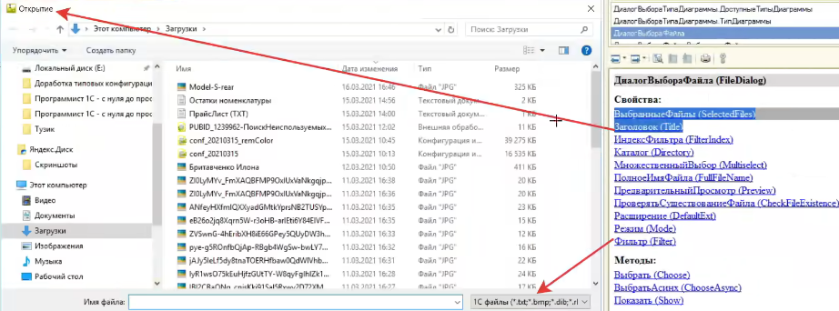

**Т15_1: Диалоги**

---

_1. Диалог выбора файла. Режимы (открытие, сохранение, выбор каталога)_

<details>
<summary>пример</summary>

- заголовок, фильтр



<details>
<summary>code</summary>

```js


&НаКлиенте
Процедура ВыбратьФайл(Команда)

	Проводник = Новый ДиалогВыбораФайла(РежимДиалогаВыбораФайла.Открытие);

	ЧтоНужноДелатьПосле = Новый ОписаниеОповещения("ПослеВыбораФайла", ЭтотОбъект);
	Проводник.Показать(ЧтоНужноДелатьПосле);

КонецПроцедуры

&НаКлиенте
Процедура ПослеВыбораФайла(ВыбранныеФайлы, ДополнительныеПараметры) Экспорт

	Если ВыбранныеФайлы = Неопределено Тогда
		Возврат;
	КонецЕсли;

	ПутьКФайлу = ВыбранныеФайлы[0];
	Сообщить(ПутьКФайлу);


КонецПроцедуры

&НаКлиенте
Процедура ВыбратьКаталог(Команда)

	Проводник = Новый ДиалогВыбораФайла(РежимДиалогаВыбораФайла.ВыборКаталога);

	ЧтоНужноДелатьПосле = Новый ОписаниеОповещения("ПослеВыбораКаталога", ЭтотОбъект);
	Проводник.Показать(ЧтоНужноДелатьПосле)

КонецПроцедуры

&НаКлиенте
Процедура ПослеВыбораКаталога(ВыбранныеФайлы, ДополнительныеПараметры) Экспорт

	Если ВыбранныеФайлы = Неопределено Тогда
		Возврат;
	КонецЕсли;

	ПутьКФайлу = ВыбранныеФайлы[0];
	Сообщить(ПутьКФайлу);


КонецПроцедуры

&НаКлиенте
Процедура СохранитьФайл(Команда)

	Проводник = Новый ДиалогВыбораФайла(РежимДиалогаВыбораФайла.Сохранение);

	ЧтоНужноДелатьПосле = Новый ОписаниеОповещения("ПослеВыбораСохранения", ЭтотОбъект);
	Проводник.Показать(ЧтоНужноДелатьПосле);
КонецПроцедуры

&НаКлиенте
Процедура ПослеВыбораСохранения(ВыбранныеФайлы, ДополнительныеПараметры) Экспорт

	Если ВыбранныеФайлы = Неопределено Тогда
		Возврат;
	КонецЕсли;

	ПутьКФайлу = ВыбранныеФайлы[0];
	Сообщить(ПутьКФайлу);


КонецПроцедуры

```

</details>

---

_фильтрация по расширению файла, маска файла_

> маска: \*_.расширение, Н.: (_ \*.xls )

</details>
