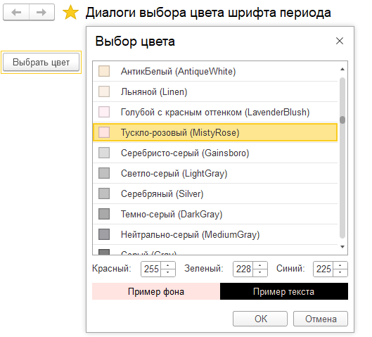
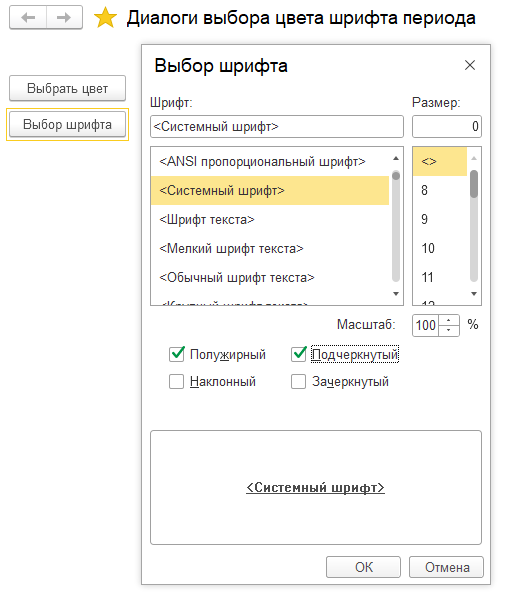
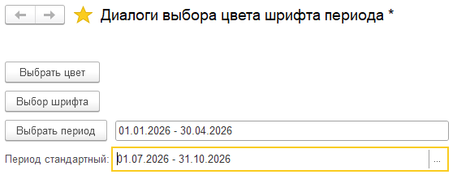

**Т15_1: Диалоги**

---

_1. Диалог выбора файла. Режимы (открытие, сохранение, выбор каталога)_

<details>
<summary>пример</summary>

- заголовок, фильтр


<details>
<summary>code</summary>

```js


&НаКлиенте
Процедура ВыбратьФайл(Команда)

	Проводник = Новый ДиалогВыбораФайла(РежимДиалогаВыбораФайла.Открытие);
	// добавляем фильтр
	Проводник.Фильтр = "Текстовый документ (*.txt)|*.txt|Табличный документ (*.mxl)|*.mxl|CSV-файл |*.csv";
	//множественный фильтр
  ФильтрКартинки = "Картинка|*.jpg;*.bmp;*.png";
	Проводник.Фильтр = ФильтрКартинки;

	ЧтоНужноДелатьПосле = Новый ОписаниеОповещения("ПослеВыбораФайла", ЭтотОбъект);
	Проводник.Показать(ЧтоНужноДелатьПосле);

КонецПроцедуры

&НаКлиенте
Процедура ПослеВыбораФайла(ВыбранныеФайлы, ДополнительныеПараметры) Экспорт

	Если ВыбранныеФайлы = Неопределено Тогда
		Возврат;
	КонецЕсли;

	ПутьКФайлу = ВыбранныеФайлы[0];
	Сообщить(ПутьКФайлу);


КонецПроцедуры

&НаКлиенте
Процедура ВыбратьКаталог(Команда)

	Проводник = Новый ДиалогВыбораФайла(РежимДиалогаВыбораФайла.ВыборКаталога);

	ЧтоНужноДелатьПосле = Новый ОписаниеОповещения("ПослеВыбораКаталога", ЭтотОбъект);
	Проводник.Показать(ЧтоНужноДелатьПосле)

КонецПроцедуры

&НаКлиенте
Процедура ПослеВыбораКаталога(ВыбранныеФайлы, ДополнительныеПараметры) Экспорт

	Если ВыбранныеФайлы = Неопределено Тогда
		Возврат;
	КонецЕсли;

	ПутьКФайлу = ВыбранныеФайлы[0];
	Сообщить(ПутьКФайлу);


КонецПроцедуры

&НаКлиенте
Процедура СохранитьФайл(Команда)

	Проводник = Новый ДиалогВыбораФайла(РежимДиалогаВыбораФайла.Сохранение);

	ЧтоНужноДелатьПосле = Новый ОписаниеОповещения("ПослеВыбораСохранения", ЭтотОбъект);
	Проводник.Показать(ЧтоНужноДелатьПосле);
КонецПроцедуры

&НаКлиенте
Процедура ПослеВыбораСохранения(ВыбранныеФайлы, ДополнительныеПараметры) Экспорт

	Если ВыбранныеФайлы = Неопределено Тогда
		Возврат;
	КонецЕсли;

	ПутьКФайлу = ВыбранныеФайлы[0];
	Сообщить(ПутьКФайлу);


КонецПроцедуры

```

</details>

---

_фильтрация по расширению файла, маска файла_

> маска: \*_.расширение, Н.: (_ \*.xls )

</details>

---

_2: Диалог выбора цвета, шрифта, периода_

  <details>
  <summary>диалог выбора цвета</summary>



```js

&НаКлиенте
Процедура ВыбратьЦвет(Команда)

ВыборЦвета = Новый ДиалогВыбораЦвета;

ЧтоДелатьПослеВыбора = Новый ОписаниеОповещения("ПослеВыбораЦвета", ЭтотОбъект);
ВыборЦвета.Показать(ЧтоДелатьПослеВыбора);

КонецПроцедуры

&НаКлиенте
Процедура ПослеВыбораЦвета(Цвет, ДополнительныеПараметры) Экспорт

  Если Цвет = Неопределено Тогда
      Возврат;
  КонецЕсли;

Сообщить("Выбран цвет: " + Цвет.Красный + "," + Цвет.Зеленый + "," + Цвет.Синий);

КонецПроцедуры // ПослеВыбораЦвета()
```

  </details>

  <details>
  <summary>диалог выбора шрифта</summary>



```js

&НаКлиенте
Процедура ВыборШрифта(Команда)

	ВыборШрифта = Новый ДиалогВыбораШрифта;

	ЧтоДелатьПослеВыбора = Новый ОписаниеОповещения("ПослеВыбораШрифта", ЭтотОбъект);
	ВыборШрифта.Показать(ЧтоДелатьПослеВыбора);
КонецПроцедуры

&НаКлиенте
Процедура ПослеВыбораШрифта(Шрифт, ДополнительныеПараметры)Экспорт

	Если Шрифт = Неопределено Тогда
		Возврат;
	КонецЕсли;

	Сообщить("Выбран шрифт: " + Шрифт.Имя + ", " + "размер: " + Шрифт.Размер);;


КонецПроцедуры // ПослеВыбораШрифта()

```

  </details>

</details>

<details>
<summary>диалог выбора периода</summary>



```js
&НаКлиенте
Процедура ВыбратьПериод(Команда)

	ВыбратьПериод = Новый ДиалогРедактированияСтандартногоПериода();
	ЧтоДелатьПослеВыбораПериода = Новый ОписаниеОповещения("ПослеВыбораПериода", ЭтотОбъект);

	ВыбратьПериод.Показать(ЧтоДелатьПослеВыбораПериода);


КонецПроцедуры

&НаКлиенте
Процедура ПослеВыбораПериода(Период, ДополнительныеПараметры)Экспорт

	Если Период = Неопределено Тогда
		Возврат;
	КонецЕсли;

	ВыбранныйПериод = Период;
	Сообщить("Выбран период: " + Период );;

КонецПроцедуры // ПослеВыбораПериода()

```

</details>
