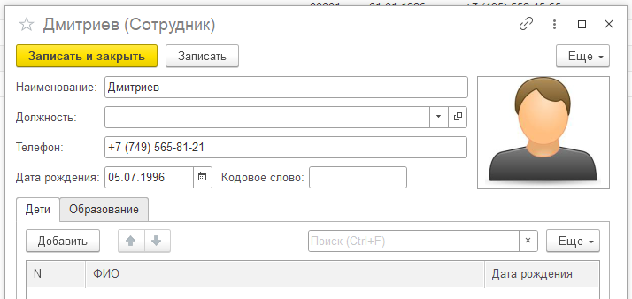

**Работа с изображениями, присоедененные файлы.**

---

_Изображения_

<details>
<summary>пример</summary>

1. Создать реквизит «Картинка» типа «Хранилище значения» в справочнике
   «Номенклатура»
2. В форме элемента создать реквизит формы «АдресКартинки» типа
   «Строка».
3. Создать элемент формы, связанный с реквизитом формы «АдресКартинки»
   (тип элемента – Поле картинки)
4. Обеспечить выбор картинки. Поместить двоичные данные во временное
   хранилище (НачатьПомещениеФайлаНаСервер). Реквизиту «АдресКартинки»
   присвоить в качестве значения адрес данных во временном хранилище.
5. Обеспечить сохранение картинки в реквизит «Изображение».
6. Обеспечить отображение картинки при открытии формы
   (ПолучитьНавигационнуюСсылку)

   > # Хранить картинки в базе - аЦкий треЕш!!!
   >
   > требующий ограничения по размеру, Н: 30кб

   > либо хранения на сетевом диске а не в базе

   ***

   

    <details>
    <summary>code</summary>

   ```javascript

    //1. ВЫБОР КАРТИНКИ И ЕЁ ОТОБРАЖЕНИЕ НА ФОРМЕ
    &НаКлиенте
    Процедура АдресКартинкиНажатие(Элемент, СтандартнаяОбработка)

      СтандартнаяОбработка = Ложь;
      Модифицированность = Истина;

      ПараметрыДиалога = Новый ПараметрыДиалогаПомещенияФайлов;
      ПараметрыДиалога.Заголовок = "Выберите изображение";
      ПараметрыДиалога.Фильтр = "Изображение | *.jpg; *.png;*.bmp;*.jpeg";

      ЧтоДелатьПослеВыбораФайла = Новый ОписаниеОповещения("ПослеВыбораФото", ЭтотОбъект);
      НачатьПомещениеФайлаНаСервер(ЧтоДелатьПослеВыбораФайла,,,,ПараметрыДиалога, УникальныйИдентификатор);

    КонецПроцедуры

    &НаКлиенте
    Процедура ПослеВыбораФото(ОписаниеПомещенногоФайла, ДополнительныеПараметры) Экспорт

      Если ОписаниеПомещенногоФайла = Неопределено Тогда
        Возврат;
      КонецЕсли;

      АдресФото = ОписаниеПомещенногоФайла.Адрес;

    КонецПроцедуры // ()

    //2. ЗАПИСЬ КАРТИНКИ В БАЗУ (Заполнение реквизита справочника)
    &НаСервере
    Процедура ПередЗаписьюНаСервере(Отказ, ТекущийОбъект, ПараметрыЗаписи)

      Если ЭтоАдресВременногоХранилища(АдресФото) Тогда
        ДанныеФото = ПолучитьИзВременногоХранилища(АдресФото);
        ТекущийОбъект.Фотография = Новый ХранилищеЗначения(ДанныеФото, Новый СжатиеДанных(9));
      ИначеЕсли ПустаяСтрока(АдресФото) Тогда
        ТекущийОбъект.Фотография = Неопределено;
      КонецЕсли;

    КонецПроцедуры

    &НаКлиенте
    Процедура ОчиститьФото(Команда)

      АдресФото = "";

    КонецПроцедуры

    //3. ОТОБРАЖЕНИЕ КАРТИНКИ ПРИ ОТРКЫТИИ ФОРМЫ
    &НаСервере
    Процедура ПриЧтенииНаСервере(ТекущийОбъект)

      АдресФото = ПолучитьНавигационнуюСсылку(ТекущийОбъект, "Фотография");

    КонецПроцедуры

   ```

    </details>

</details>
