**Документы**

---

_Зополнение связанных реквизитов_

<details>
<summary>пример</summary>

- выбор договоров по конкретному контрагенту

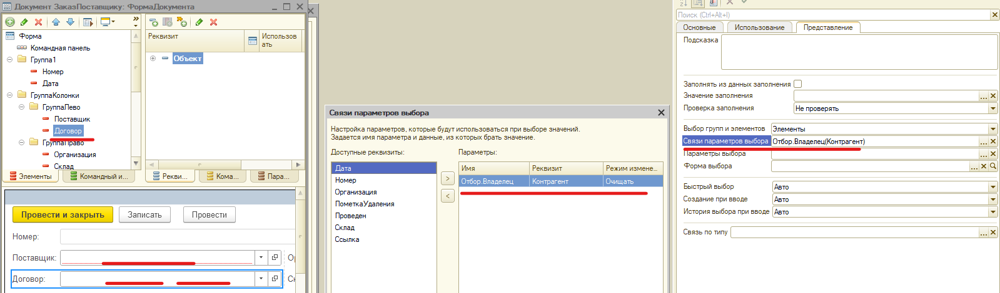

</details>

---

_Переодичность нумерации_

<details>
<summary>пример</summary>

- интервальная нумерация документов

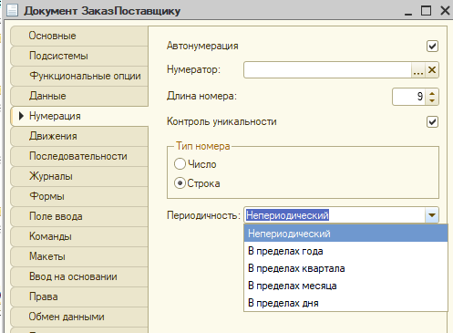

</details>

---

_Установка курсора на нужном поле формы_

<details>
<summary>пример</summary>

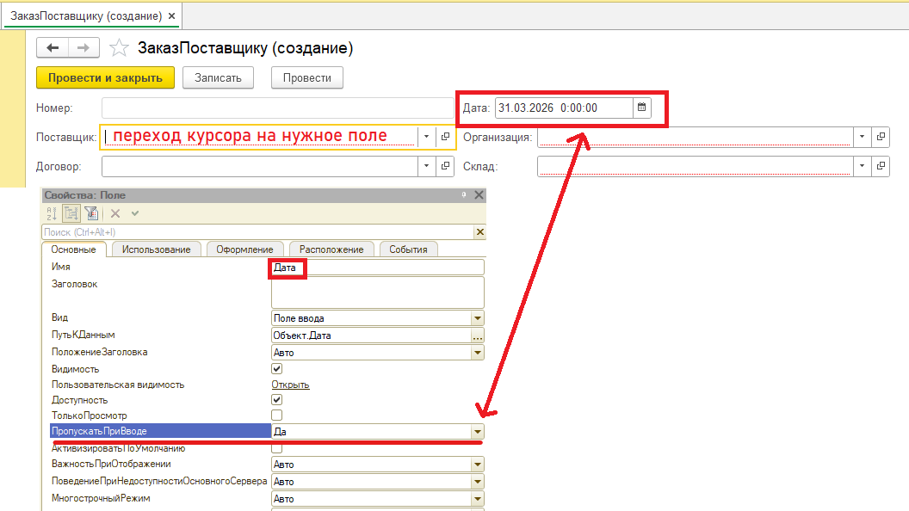

</details>

---

_Сквозная нумерация_

<details>
<summary>пример</summary>

- номер увеличивается сквозь разные виды документов

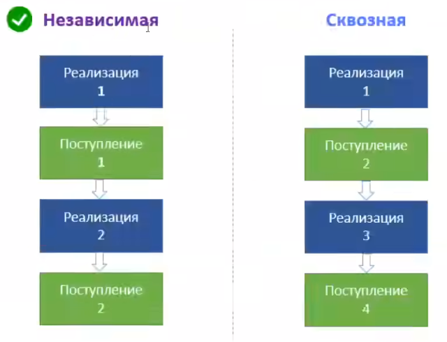

</details>

---

_Префиксы_

- обычно содержат данные инф.базы и назв.организации, Н:(УТ-Азимут-00001)

<details>
<summary>пример</summary>

- программно или через интерфейс пользователя

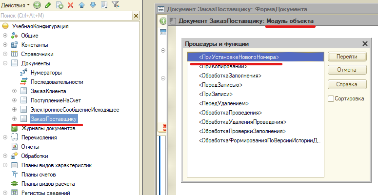

</details>

---

_Момент времени = дата + ссылка_

- точное время проведения документа

<details>
<summary>пример</summary>

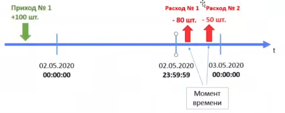

</details>

---

_Проведение документа_

- необходимо не для всех документов (счет на оплату)

- (проведение) - возможность менять состояние других учетных данных

- (проведен) - отраженная в учете хозяйственная операция

- оперативное проведение (проведение с проверками в реальном времени, невозможность провести будущим/задним числом) (вопрос измениния системного времени!) (последовательность - отслеживание изменений задним числом)

# Задачки

- автоматическое заполнение данными номенклатуры табличной части документа(заполнение связанных реквизитов)

<details>
<summary>code</summary>

```js
&НаКлиенте
Процедура ТоварыНоменклатураПриИзменении(Элемент)

	//получаем данные текущей строки
	ТоварнаяПозиция = Элементы.Товары.ТекущиеДанные;
	//получаем ставку НДС и ЕдИзм для текущей номенклатуры
	Товар = ПолучитьЕденицыИзмеренияИНДС(ТоварнаяПозиция.Номенклатура);

	//заполняем данные в строке
	ТоварнаяПозиция.ЕдИзм = Товар.ЕдИзм;
	ТоварнаяПозиция.СтавкаНДС = Товар.СтавкаНДС;

КонецПроцедуры

&НаСервереБезКонтекста
Функция ПолучитьЕденицыИзмеренияИНДС(ТоварнаяПозиция)

	Товар = Новый Структура;
	Товар.Вставить("ЕдИзм", ТоварнаяПозиция.ЕдиницаИзмерения);
	Товар.Вставить("СтавкаНДС", ТоварнаяПозиция.СтавкаНДС);

	Возврат Товар

КонецФункции // ПолучитьЕденицыИзмеренияИНДС()

//с проверкой на невыбранную товарную позицию
//-------------------------------------------
//-------------------------------------------
&НаКлиенте
Процедура ТоварыНоменклатураПриИзменении(Элемент)

	//получаем данные текущей строки
	ТоварнаяПозиция = Элементы.Товары.ТекущиеДанные;

	//получаем ставку НДС и ЕдИзм для текущей номенклатуры
	Товар = ПолучитьЕденицыИзмеренияИНДС(ТоварнаяПозиция.Номенклатура);

	//заполняем данные в строке
	Если Товар = Неопределено Тогда
		ТоварнаяПозиция.ЕдИзм = Неопределено;
		ТоварнаяПозиция.СтавкаНДС = Неопределено;
	Иначе
		ТоварнаяПозиция.ЕдИзм = Товар.ЕдИзм;
		ТоварнаяПозиция.СтавкаНДС = Товар.СтавкаНДС;
	КонецЕсли;

КонецПроцедуры

&НаСервереБезКонтекста
Функция ПолучитьЕденицыИзмеренияИНДС(ТоварнаяПозиция)


	//Если ТоварнаяПозиция.Пустая()Тогда
	//	Возврат Неопределено;
	//КонецЕсли;
	//
	//Товар = Новый Структура;
	//Товар.Вставить("ЕдИзм", ТоварнаяПозиция.ЕдиницаИзмерения);
	//Товар.Вставить("СтавкаНДС", ТоварнаяПозиция.СтавкаНДС);
	//
	//Возврат Товар

	// ИЛИ

	Если ТоварнаяПозиция.Пустая()Тогда
		Возврат Неопределено;
	КонецЕсли;

	ДанныеТовара = ТоварнаяПозиция.ПолучитьОбъект();

	Товар = Новый Структура;
	Товар.Вставить("ЕдИзм", ДанныеТовара.ЕдиницаИзмерения);
	Товар.Вставить("СтавкаНДС", ДанныеТовара.СтавкаНДС);

	Возврат Товар
КонецФункции // ПолучитьЕденицыИзмеренияИНДС()

//выносим функцию сервера в общий модуль для большей универсальности
//-------------------------------------------
//-------------------------------------------

//процедура в модуле формы

&НаКлиенте
Процедура ТоварыНоменклатураПриИзменении(Элемент)

	//получаем данные текущей строки
	ТоварнаяПозиция = Элементы.Товары.ТекущиеДанные;

	СписокРеквизитов = "ЕдИзм,СтавкаНДС";

	//получаем ставку НДС и ЕдИзм для текущей номенклатуры
	Товар = ОбщегоНазначенияВызовСервера.ПолучитьЕденицыИзмеренияИНДС(ТоварнаяПозиция.Номенклатура,СписокРеквизитов);

	//заполняем данные в строке
	Если Товар = Неопределено Тогда
		ТоварнаяПозиция.ЕдИзм = Неопределено;
		ТоварнаяПозиция.СтавкаНДС = Неопределено;
	Иначе
		ТоварнаяПозиция.ЕдИзм = Товар.ЕдИзм;
		ТоварнаяПозиция.СтавкаНДС = Товар.СтавкаНДС;
	КонецЕсли;

КонецПроцедуры

//экспортная функция в общем модуле с проверкой

Функция ПолучитьЕденицыИзмеренияИНДС(ТоварнаяПозиция,СписокИменРеквизитов) Экспорт


	//Если ТоварнаяПозиция.Пустая()Тогда
	//	Возврат Неопределено;
	//КонецЕсли;
	//
	//Товар = Новый Структура;
	//Товар.Вставить("ЕдИзм", ТоварнаяПозиция.ЕдиницаИзмерения);
	//Товар.Вставить("СтавкаНДС", ТоварнаяПозиция.СтавкаНДС);
	//
	//Возврат Товар

	// ИЛИ

	Если ТоварнаяПозиция.Пустая()Тогда
		Возврат Неопределено;
	КонецЕсли;

	МассивРеквизитов = СтрРазделить(СписокИменРеквизитов,",");
	ДанныеТовара = ТоварнаяПозиция.ПолучитьОбъект();

	Товар = Новый Структура;

	//проверяем есть ли переданные реквизиты вообще в справочнике
	РеквизитыСправочника = Метаданные.Справочники.Номенклатура.Реквизиты;

	Для каждого ИмяРеквизита Из МассивРеквизитов  Цикл

		Если РеквизитыСправочника.Найти(ИмяРеквизита) = Неопределено Тогда
			ЗначениеРеквизита = Неопределено;
		Иначе
			ЗначениеРеквизита = ДанныеТовара[ИмяРеквизита];
		КонецЕсли;

		Товар.Вставить(ИмяРеквизита, ЗначениеРеквизита);

	КонецЦикла;

	Возврат Товар


КонецФункции // ПолучитьЕденицыИзмеренияИНДС()

```

</details>

---

- изменение ширины табличного элемента

<details>
<summary>пример</summary>

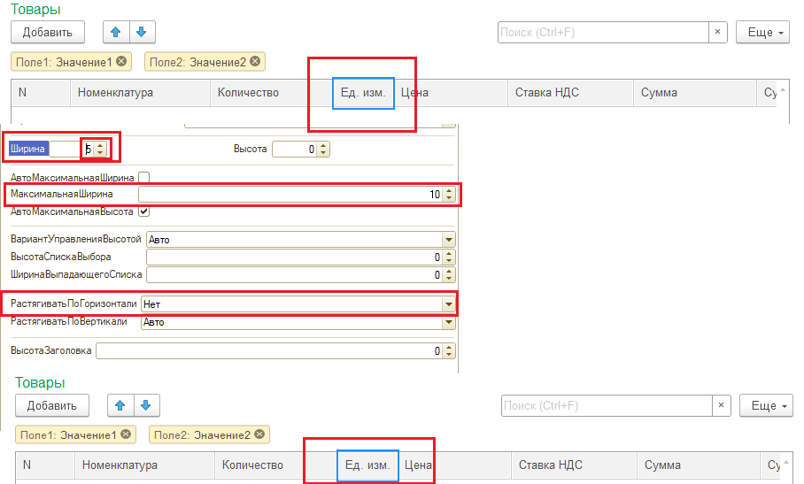

</details>

---

- пересчет сумм табличной части

 <details>
 <summary>code</summary>

```js

	&НаКлиенте
	Процедура ТоварыНоменклатураПриИзменении(Элемент)

	//получаем данные текущей строки
	ТоварнаяПозиция = Элементы.Товары.ТекущиеДанные;

	СписокРеквизитов = "ЕдиницаИзмерения,СтавкаНДС";

	//получаем ставку НДС и ЕдИзм для текущей номенклатуры
	Товар = ОбщегоНазначенияВызовСервера.ПолучитьЕденицыИзмеренияИНДС(ТоварнаяПозиция.Номенклатура,СписокРеквизитов);

	//заполняем данные в строке
	Если Товар = Неопределено Тогда
		ТоварнаяПозиция.ЕдиницаИзмерения = Неопределено;
		ТоварнаяПозиция.СтавкаНДС = Неопределено;
	Иначе
		ТоварнаяПозиция.ЕдиницаИзмерения = Товар.ЕдиницаИзмерения;
		ТоварнаяПозиция.СтавкаНДС = Товар.СтавкаНДС;
	КонецЕсли;

	КонецПроцедуры

	&НаКлиенте
	Процедура ТоварыКоличествоПриИзменении(Элемент)

	ТоварнаяПозиция = Элементы.Товары.ТекущиеДанные;
	ТоварнаяПозиция.Сумма = ТоварнаяПозиция.Цена * ТоварнаяПозиция.Количество;

	НДС = ПолучениеСтавкиНДС(ТоварнаяПозиция.СтавкаНДС);
	ТоварнаяПозиция.СуммаНДС = ТоварнаяПозиция.Сумма * НДС / 100;

	КонецПроцедуры

	&НаКлиенте
	Процедура ТоварыЦенаПриИзменении(Элемент)

	ТоварнаяПозиция = Элементы.Товары.ТекущиеДанные;
	ТоварнаяПозиция.Сумма = ТоварнаяПозиция.Цена * ТоварнаяПозиция.Количество;

	НДС = ПолучениеСтавкиНДС(ТоварнаяПозиция.СтавкаНДС);
	ТоварнаяПозиция.СуммаНДС = ТоварнаяПозиция.Сумма * НДС / 100;

	ТоварнаяПозиция.СуммаВсего = ТоварнаяПозиция.СуммаНДС + ТоварнаяПозиция.Сумма;

	КонецПроцедуры

	&НаКлиенте
	Процедура ТоварыСтавкаНДСПриИзменении(Элемент)

	ТоварнаяПозиция = Элементы.Товары.ТекущиеДанные;

	НДС = ПолучениеСтавкиНДС(ТоварнаяПозиция.СтавкаНДС);
	ТоварнаяПозиция.СуммаНДС = ТоварнаяПозиция.Сумма * НДС / 100;

	ТоварнаяПозиция.СуммаВсего = ТоварнаяПозиция.СуммаНДС + ТоварнаяПозиция.Сумма;

	КонецПроцедуры

	&НаСервереБезКонтекста
	Функция ПолучениеСтавкиНДС(Ставка)

	Если Ставка = 	Перечисления.СтавкиНДС.БезНДС ИЛИ Ставка = Перечисления.СтавкиНДС.НДС0 Тогда
		Значение = 0;
	ИначеЕсли Ставка = Перечисления.СтавкиНДС.НДС10  Тогда
		Значение = 10;
	ИначеЕсли Ставка = Перечисления.СтавкиНДС.НДС18  Тогда
		Значение = 18;
	ИначеЕсли Ставка = Перечисления.СтавкиНДС.НДС20 Тогда
		Значение = 20;
	КонецЕсли;

	Возврат Значение;

	КонецФункции // ПолучениеЧислаСтавкиНДС()

```

 </details>

---

- рефакторинг | добовление подвала в форму

 <details>
 <summary>подробне</summary>

- вынос переиспользуемых функций в общий модуль

---

- подвал

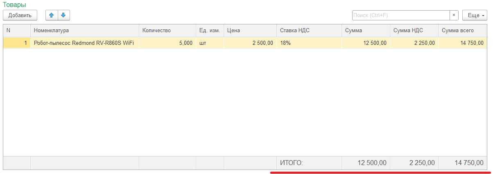

 </details>

---

- сумма документа в форме списка

 <details>
 <summary>code</summary>

- добавляем реквизит СуммаДокумента
- в модуле объкта создаем событие ПередЗаписью

```js

Процедура ПередЗаписью(Отказ, РежимЗаписи, РежимПроведения)
	СуммаДокумента = Товары.Итог("СуммаВсего");
КонецПроцедуры

```

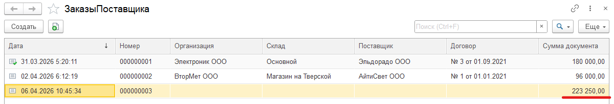

 </details>

---

- закладки на табличной части | пересчет услуг | итоговая сумма

 <details>
 <summary>code</summary>

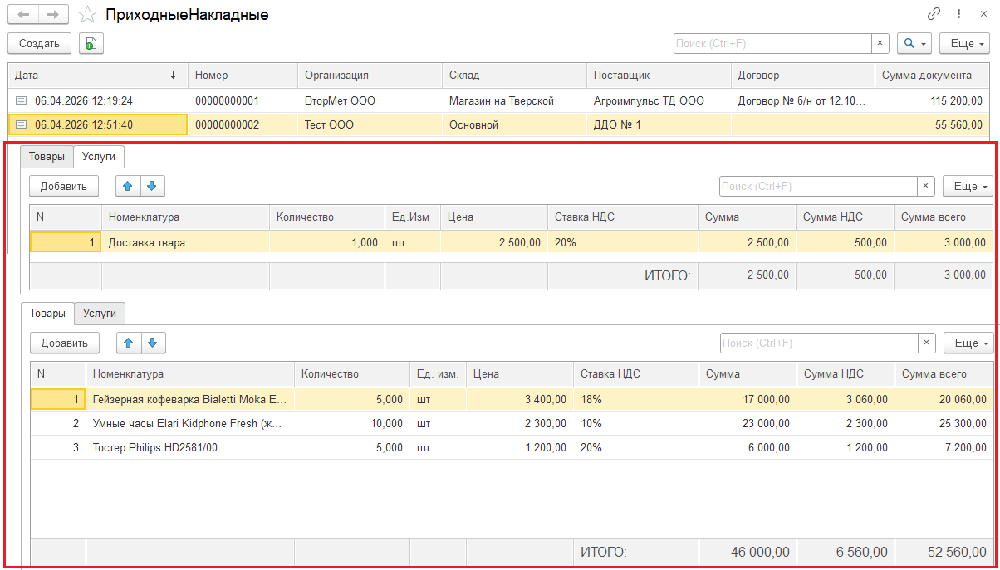

```js
Процедура ПередЗаписью(Отказ, РежимЗаписи, РежимПроведения)
	СуммаДокумента = Товары.Итог("СуммаВсего") + Услуги.Итог("СуммаВсего");
КонецПроцедуры

```

 </details>

---

- отбор по поставщику

 <details>
 <summary>подробнее</summary>

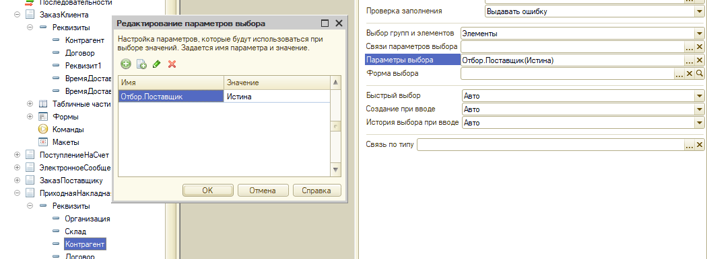

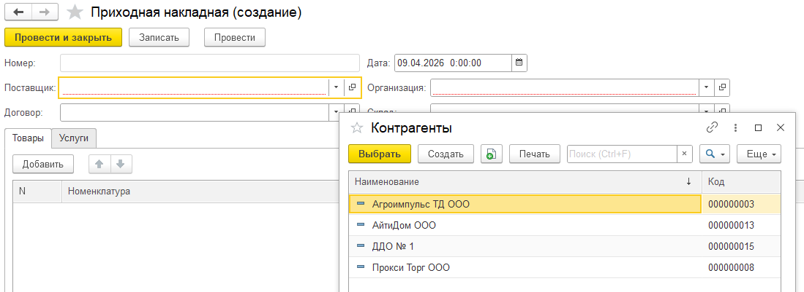

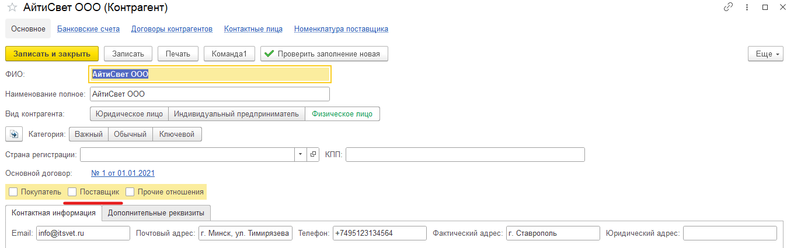

 </details>

---

- идентификация номерклатуры (товар/услуга)
  - добавить Перечисления→ТипНоменклатуры
  - добавить Справочники→ВидНоменклатуры.Реквизиты→ТипНоменклатуры
  - добавить Справочники→Номенклатура.Реквизиты→ТипНоменклатуры
  - добавляем поле в Справочники→Номенклатура.Формы.ФормаЭлемента→ТипНоменклатуры(поле надписи(не редактируется пользователем))
  - добавляем код на клиенте и на сервере без контекста
  <details>
  <summary>code</summary>

  ```js

  &НаКлиенте
  	Процедура ВидНоменклатурыПриИзменении(Элемент)
  		Объект.ТипНоменклатуры = ПолучитьТипНоменклатуры(Объект.ВидНоменклатуры);
  	КонецПроцедуры

  &НаСервереБезКонтекста
  	Функция ПолучитьТипНоменклатуры(ВидНоменклатуры)

  		Если ВидНоменклатуры = Неопределено  Тогда
  			Возврат ВидНоменклатуры = Перечисления.ТипНоменклатуры.ПустаяСсылка();
  		КонецЕсли;

  		//ВидНоменклатурыОбъект = ВидНоменклатуры.ПолучитьОбъект();
  		//Тип = ВидНоменклатурыОбъект.ТипНоменклатуры;

  		Тип = ВидНоменклатуры.ТипНоменклатуры;

  		Возврат Тип;

  	КонецФункции // ПолучитьТипНоменклатуры()()

  ```

  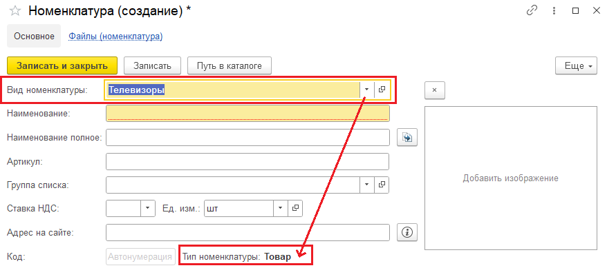

  </details>

---

- массовая замена элементов справочника (добавление типа номенклатуры в номенклатуре)

  <span style="color:grey">бургер→файл→открыть</span>

  > Ответ: консоль кода.epf

  <details>
  <summary>code</summary>

  ```js

  ВыборкаНоменклатура = Справочники.Номенклатура.Выбрать();

  Пока ВыборкаНоменклатура.Следующий() Цикл

  Если ВыборкаНоменклатура.ЭтоГруппа Тогда
  		Продолжить;
  КонецЕсли;

  ТекущийОбъект = ВыборкаНоменклатура.ПолучитьОбъект();
  ТекущийОбъект.ТипНоменклатуры = Перечисления.ТипНоменклатуры.Товар;

  ТекущийОбъект.Записать();

  КонецЦикла;

  ```

  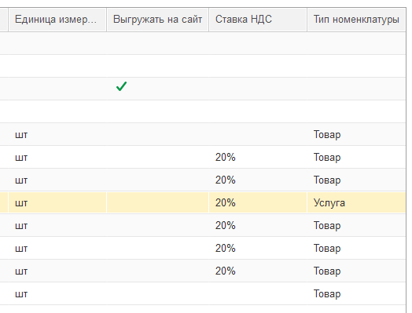

  </details>

---

- установка параметров выбора с отбором по типу (заказ../приходная..)
  <details>
  <summary>подробнее</summary>

  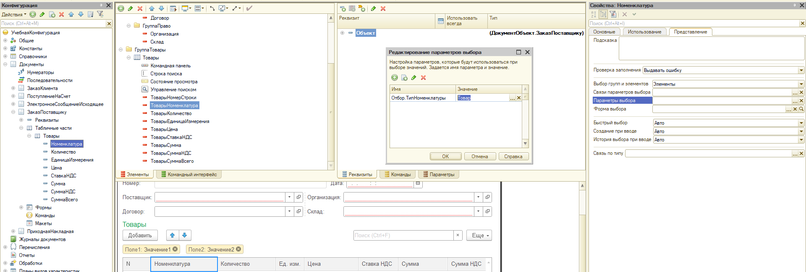

  </details>
