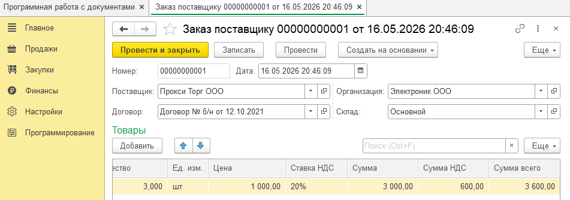

**Документы.часть2**

---

_Программное создание документа, база_

<details>
<summary>code</summary>

```js
  &НаСервере
Процедура СоздатьДокументНаСервере()

	//Организация - "Электроник ООО"
	//Склад - "Основной"
	//Контрагент - "Прокси Торг ООО"
	//договор - "00020";
	//Номенклатура "Робот-пылесос Redmond RV-R650S WiFi"
	НовыйЗаказ = Документы.ЗаказПоставщику.СоздатьДокумент();

	//реквизиты шапки
	НовыйЗаказ.Дата = ТекущаяДата();
	НовыйЗаказ.Организация = Справочники.Организации.НайтиПоНаименованию("Электроник ООО");
	НовыйЗаказ.Склад = Справочники.Склады.НайтиПоНаименованию("Основной");
	НовыйЗаказ.Контрагент = Справочники.Контрагенты.НайтиПоНаименованию("Прокси Торг ООО");
	НовыйЗаказ.Договор = Справочники.ДоговорыКонтрагентов.НайтиПоКоду("00020");

	//табличная часть
	СтрокаТовары = НовыйЗаказ.Товары.Добавить();
	СтрокаТовары.Номенклатура = Справочники.Номенклатура.НайтиПоНаименованию("Робот-пылесос Redmond RV-R650S WiFi");
	СтрокаТовары.Количество = 3;
	СтрокаТовары.Цена = 1000;

	ИменаРеквизитов = "ЕдиницаИзмерения,СтавкаНДС";
	РеквизитыНоменклатуры = ОбщегоНазначенияВызовСервера.ПолучитьРеквизитыНоменклатуры(СтрокаТовары.Номенклатура, ИменаРеквизитов);

	СтрокаТовары.ЕдиницаИзмерения = РеквизитыНоменклатуры.ЕдиницаИзмерения;
	СтрокаТовары.СтавкаНДС = РеквизитыНоменклатуры.СтавкаНДС;

	ОбработкаТабличнхЧастейСервер.РассчитатьСуммыВСтрокеТабличнойЧасти(СтрокаТовары);

	НовыйЗаказ.Записать();

КонецПроцедуры

```



</details>

---

_Поиск документа с периодичностью(нужен интервал) и без_

<details>
<summary>code</summary>

```js
&НаСервере
Процедура НайтиДокументНаСервере()

//Найти документ с номером "00000000005" и сообщить сумму документа
//не периодичный
НайденныйДокумент = Документы.ЗаказПоставщику.НайтиПоНомеру("00000000005");
//переодичный
// НайденныйДокумент = Документы.ЗаказПоставщику.НайтиПоНомеру("00000000005", ТекущаяДата());

Если НайденныйДокумент.Пустая() Тогда
Сообщение = Новый СообщениеПользователю;
Сообщение.Текст = "Документ с номером ""00000000005"" не найден";
Сообщение.Сообщить();
Иначе

ДокументОбъект = НайденныйДокумент.ПолучитьОбъект();

Сообщение = Новый СообщениеПользователю;
Сообщение.Текст = "Сумма документа: " + ДокументОбъект.СуммаДокумента;
Сообщение.Сообщить();

КонецЕсли;

КонецПроцедуры

&НаКлиенте
Процедура НайтиДокумент(Команда)
НайтиДокументНаСервере();
КонецПроцедуры

```

</details>

---

_Изменение документа(Н:количество)_

<details>
<summary>code</summary>

```js
Процедура ИзменитьДокументНаСервере()

//1. найти ссылку на документ
СсылкаНаДокумент = Документы.ЗаказПоставщику.НайтиПоНомеру("00000000009", ТекущаяДата());

Если СсылкаНаДокумент.Пустая() Тогда
Сообщение = Новый СообщениеПользователю;
Сообщение.Текст = "Документ с номером ""00000000009"" не найден";
Сообщение.Сообщить();
Возврат;
КонецЕсли;

//2. получить объект по ссылке
ДокументОбъект = СсылкаНаДокумент.ПолучитьОбъект();

//3. Изменить данные объекта
Для каждого СтрокаТЧ Из ДокументОбъект.Товары Цикл
СтрокаТЧ.Количество = СтрокаТЧ.Количество + 1;
  ОбработкаТабличнхЧастейСервер.РассчитатьСуммыВСтрокеТабличнойЧасти(СтрокаТЧ);
КонецЦикла;

//4. записать документ
ДокументОбъект.Записать();

Сообщение = Новый СообщениеПользователю;
Сообщение.Текст = "Документ успешно изменен...";
Сообщение.Сообщить();

КонецПроцедуры

```

</details>
