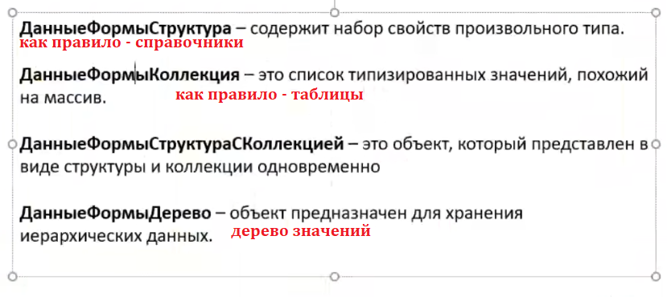

**Т14: Типы данных. Программное создание элементов и реквизитов формы.**

    Поиск → ФОРМА КЛИЕНТСКОГО ПРИЛОЖЕНИЯ

<details>
<summary>пример</summary>

- имитация типов данных указывается в скобках - ()
- фактические типы - без

---

![alt text][def]

---

_посмотреть тип можно через отладчик_



_Пример программной записи объекта(справочники.контрагенты) из произвольной формы(обработка)_
_ОЧЕВИДНО, ТОЛЬКО КОНТЕКСТНЫЙ ВЫЗОВ_(передается вся форма)

```js
&НаСервере
Процедура ЗаписатьКонтрагентаНаСервере()

	//Контрагент - ДанныеФормыСтруктура

	//1. Преобразование ДанныеФормыСтруктура -> СправочникОбъект.Контрагенты
	КонтрагентОбъект = РеквизитФормыВЗначение("Контрагент");

	//2. Вызов метода "Записать()" для объекта СправочникОбъект.Контрагенты
	КонтрагентОбъект.Записать();

	//3. Преобразование СправочникОбъект.Контрагенты -> ДанныеФормыСтруктура
	ЗначениеВРеквизитФормы(КонтрагентОбъект, "Контрагент");

КонецПроцедуры

&НаКлиенте
Процедура ЗаписатьКонтрагента(Команда)
	ЗаписатьКонтрагентаНаСервере();
КонецПроцедуры

```

</details>

---

[def]: img/t14-emulyacia-tipa-dannyx.png

_Из модуля формы вызвать модуль объекта можно, наоборот нет!_
_поэтому код(обработка/чтение данных), не связанный с формой, лучше писать в модуле объекта/менеджере объекта_

<details>
<summary>пример</summary>

![alt text][obj-module]

[obj-module]: img/t14-module-obj.png

</details>

---

_Кастомная проверка заполнения на форме по кнопке_

<details>
<summary>пример</summary>

```js

&НаКлиенте
Процедура ПроверитьЗаполнениеНовая(Команда)

	ПроверитьЗаполнениеНоваяНаСервере();

КонецПроцедуры


&НаСервере
Процедура ПроверитьЗаполнениеНоваяНаСервере()

	//1. Преобразование ДанныеФормыСтруктура -> СправочникОбъект.Контрагенты
	КонтрагентОбъект = РеквизитФормыВЗначение("Объект");

	//2. Вызов метода "Записать()" для объекта СправочникОбъект.Контрагенты
	РезультатПроверки = КонтрагентОбъект.ПроверитьЗаполнение();

	Если РезультатПроверки = Истина Тогда
		Сообщить("Ошибок не обнаружено!");
	КонецЕсли;

	//3. Преобразование СправочникОбъект.Контрагенты -> ДанныеФормыСтруктура
	//ЗначениеВРеквизитФормы(КонтрагентОбъект, "Контрагент");

КонецПроцедуры // ПроверитьЗаполнениеНоваяНаСервере()
```

</details>

---

_Путь в каталоге_

<details>
<summary>пример</summary>

![alt text][catalog]

```js
&НаСервер
Процедура ПутьВКаталогеНаСервере()

	//1. Преобразование ДанныеФормыСтруктура -> СправочникОбъект.Контрагенты
	НоменклатураОбъект = РеквизитФормыВЗначение("Объект");

	//2. Вызов метода "ПолноеНаименование()" для объекта СправочникОбъект.Контрагенты
	ПутьВКаталоге = НоменклатураОбъект.ПолноеНаименование();

КонецПроцедуры

&НаКлиенте
	Процедура ПутьВКаталоге(Команда)
	ПутьВКаталогеНаСервере();
КонецПроцедуры

```

</details>

[catalog]: img/t14catalog-link.png

---

_Создание реквизита программно_

<details>
<summary>пример</summary>

```js

	&НаСервере
	Процедура СоздатьРеквизитыНаСервере()

		ТипСтрока = Новый ОписаниеТипов("Строка");
		ТипНоменклатура = Новый ОписаниеТипов("СправочникСсылка.Номенклатура");
		ТипЧисло = Новый ОписаниеТипов("Число");

		//1. Создать объект "РеквизитФормы"
		РеквизитТекст = Новый РеквизитФормы("ТекстСообщения", ТипСтрока);
		РеквизитНоменклатура = Новый РеквизитФормы("Номенклатура", ТипНоменклатура);
		РеквизитКоличество = Новый РеквизитФормы("Количество", ТипЧисло);
		РеквизитЦена = Новый РеквизитФормы("Цена", ТипЧисло);

		//2. Создать массив добавляемых реквизитов
		ДобавляемыеРеквизиты = Новый Массив;
		ДобавляемыеРеквизиты.Добавить(РеквизитТекст);
		ДобавляемыеРеквизиты.Добавить(РеквизитНоменклатура);
		ДобавляемыеРеквизиты.Добавить(РеквизитКоличество);
		ДобавляемыеРеквизиты.Добавить(РеквизитЦена);

		//3. Вызвать метод объекта "ФормаКлиентскогоПриложения" - ИзменитьРеквизиты()
		ИзменитьРеквизиты(ДобавляемыеРеквизиты);

	КонецПроцедуры

	&НаКлиенте
	Процедура СоздатьРеквизиты(Команда)
		СоздатьРеквизитыНаСервере();
	КонецПроцедуры

```

</details>

---

_Создание элемента программно_

<details>
<summary>пример</summary>

![alt text][elem-rekvizit]

```js
&НаКлиенте
Процедура СоздатьВсеЭлементы(Команда)
	СоздатьВсеЭлементыНаСервере();
КонецПроцедуры

&НаСервере
Процедура СоздатьВсеЭлементыНаСервере()

	Если Элементы.Найти("ТекстСообщения") = Неопределено Тогда
		НовыйЭлемент = Элементы.Добавить("ТекстСообщения", Тип("ПолеФормы"), Элементы.ГруппаПраво);
		НовыйЭлемент.ПутьКДанным = "ТекстСообщения";
		НовыйЭлемент.Вид = ВидПоляФормы.ПолеВвода;
	КонецЕсли;

	Если Элементы.Найти("Номенклатура") = Неопределено Тогда
		НовыйЭлемент = Элементы.Добавить("Номенклатура", Тип("ПолеФормы"), Элементы.ГруппаПраво);
		НовыйЭлемент.ПутьКДанным = "Номенклатура";
		НовыйЭлемент.Вид = ВидПоляФормы.ПолеВвода;
	КонецЕсли;

	Если Элементы.Найти("Количество") = Неопределено Тогда
		НовыйЭлемент = Элементы.Добавить("Количество", Тип("ПолеФормы"), Элементы.ГруппаПраво);
		НовыйЭлемент.ПутьКДанным = "Количество";
		НовыйЭлемент.Вид = ВидПоляФормы.ПолеВвода;
	КонецЕсли;

	Если Элементы.Найти("Цена") = Неопределено Тогда
		НовыйЭлемент = Элементы.Добавить("Цена", Тип("ПолеФормы"), Элементы.ГруппаПраво);
		НовыйЭлемент.ПутьКДанным = "Цена";
		НовыйЭлемент.Вид = ВидПоляФормы.ПолеВвода;
	КонецЕсли;

КонецПроцедуры // СоздатьВсеЭлементыНаСервере()

```

</details>

[elem-rekvizit]: img/t14recvizit-elem-progmn.png
